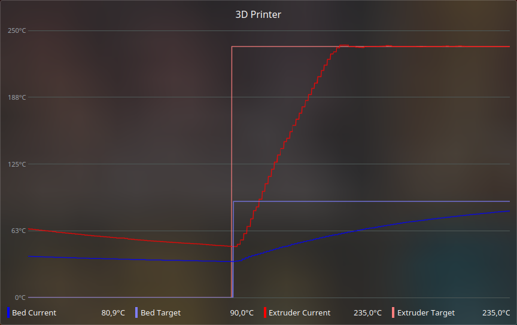

KSystemStats Scripts
====================

Simple way to create custom sensors for KDE System Monitor via text streams.



Building and installation
------------------------

1. Clone repo.
```
$ git clone https://github.com/KerJoe/ksystemstats-scripts.git
$ cd ksystemstats-scripts
```

2. Create build directory and compile.
```
$ mkdir build
$ cd build
$ cmake ..
$ cmake --build .
```

3. Install into `/usr/lib/qt/plugins/ksystemstats/`.
```
# cmake --install
```

4. Restart ksystemstats for changes to take effect.
```
$ setsid ksystemstats --replace
```

Scripts folder
--------------

Scripts should be added into `~/.local/share/ksystemstats-scripts/` (which is created after first launch of the plugin). Adding scripts into subfolders is also supported.

```
~/.local/share/ksystemstats-scripts/
├── example.sh
└── folder
    └── example.py
```

You can update script list and restart modified ones by using touching the folder (`touch ~/.local/share/ksystemstats-scripts/`).

**NOTE:** Some changes require refreshing the system sensor by, for example, changing the display style, adding/removing sensors or reopening the system monitor.

Example
-------

```Python
#!/usr/bin/env python

import random

while True:
    req = input().strip().split("\t")
    if req[0] == "?":
        print("irandom")
    elif req[0] == "irandom":
        if (req[1] == "value"):
            print(random.randint(0, 100))
        elif (req[1] == "min"):
            print(0)
        elif (req[1] == "max"):
            print(100)
        elif (req[1] == "unit"):
            print("%")
        else:
            print()
    else:
        print()

```

For extra examples see `example.py` and `example.sh`.

Protocol
--------

The plugin communicates with scripts via stdin and stdout by issuing commands with arguments separated by tabs and ending in a newline, e.g. `"sensor_name\tvalue\n"`. All commands are optional.

### `?` command

The plugins starts by requesting a list of sensors using a `"?"` command, the script should respond by a tab separated list of  all available sensors.

```
> ?↵
< sensor_1⇥sensor_2⇥sensor_3↵
```

### `value` command
A current value of the sensor.
```
> sensor_1⇥value↵
< 63.8↵
```

### `initial_value` command
A starting value of the sensor.
```
> sensor_1⇥value↵
< 50↵
```

### `name` command
A human readable name of the sensor.
```
> sensor_1⇥name↵
< Sensor number one↵
```

### `short_name` command
A name displayed when there's not enough space for the full name.
```
> sensor_1⇥short_name↵
< Sensor #1↵
```

### `prefix` command
A prefix before sensor name, e.g. "Unit 1 Sensor number one".
```
> sensor_1⇥prefix↵
< Unit 1↵
```

### `description` command
A sensor description.
```
> sensor_1⇥description↵
< The most sensitive sensible sensor↵
```

### `min` command
A minimum value the sensor value can take (values are not clipped, it is a hint for graphs).
```
> sensor_1⇥min↵
< -100↵
```

### `max` command
A maximum value the sensor value can take (values are not clipped, it is a hint for graphs).
```
> sensor_1⇥max↵
< 100↵
```

### `unit` command
A name of the unit of the sensor value.
```
> sensor_1⇥unit↵
< B↵
```
| Response | Meaning |
|----------|---------|
| -        | No unit (123 123) |
| B        | Bytes (120.2 KiB) |
| B/s      | Bytes per second (120.2 KiB/s) |
| Hz       | Hertz (123.1 kHz) |
| Timestamp| Amount of seconds since boot (Yesterday at 12:34) |
| s        | Seconds (123 123s) |
| Time     | Time (34:12:03) |
| Ticks    | Number of kernel ticks (0:20:31 (if `CONFIG_HZ` is 100)) |
| C        | Degrees celsius (123 123°C) |
| b/s      | Bits per second (120.2 Kbps) |
| dBm      | Decibel-milliwatts (123 123 dBm) |
| %        | Percent (123 123%) |
| rate     | Rate of change (123 123 s⁻¹) |
| rpm      | Revolutions per minute (123 123 RPM) |
| V        | Volts (123 123 V) |
| W        | Watts (123 123 W) |
| Wh       | Watt Hour (123 123 Wh) |
| A        | Ampere  (123 123 A)|

### `variant_type` command
A name of QVariant type of sensor value.
```
> sensor_1⇥variant_type
< double
```